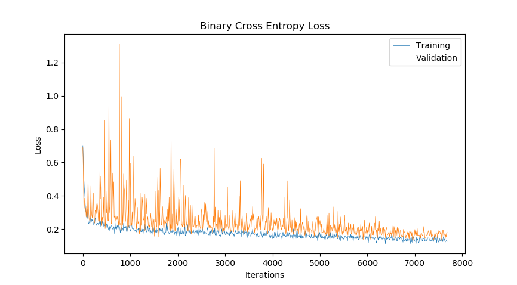
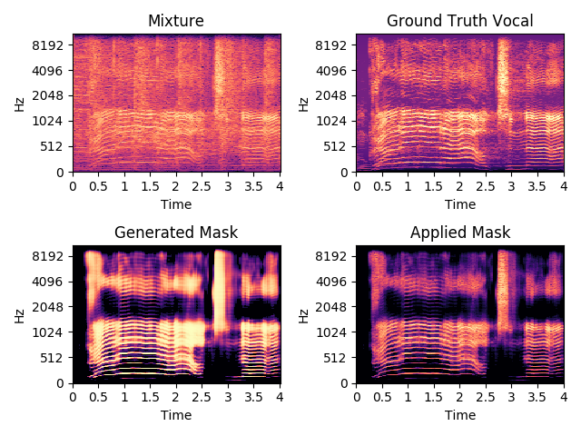
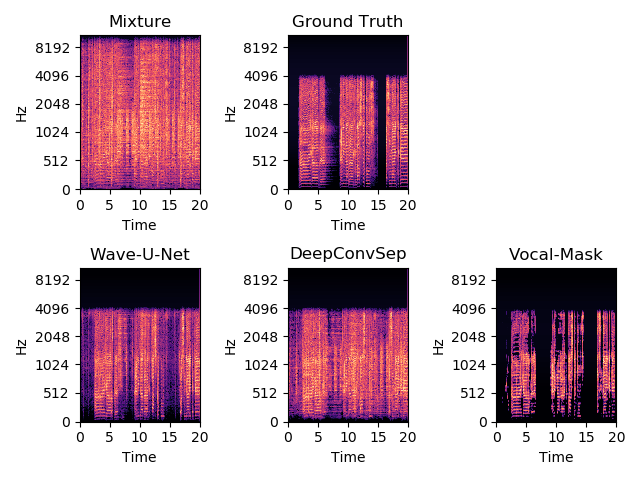
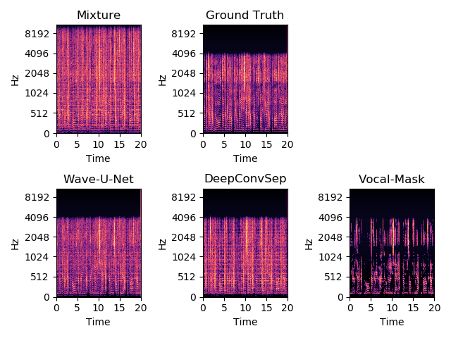

# Vocal Mask CNN

Monoaural audio source separation in the music domain using deep convolutional neural networks.

## Overview

### Problem Formulation

Given a piece of music as input, we want to separate the vocals from the accompanying instrumentation. There are many use cases for this - in music production, a producer may want to extract the vocals from a sample for creative purposes, or a VOIP (voice over IP) application may use it to enhance audio clarity. 

### Approach

We initially considered a WaveNet based approach [1], but since the models were large and potentially difficult to train, we decided it would be best to work with images by converting the input audio to spectrograms via **Short Time Fourier Transforms** (STFT). [DeepConvSep](https://github.com/MTG/DeepConvSep) is a state-of-the-art spectrogram-based model that uses an encoder-decoder strategy applied to the input spectrogram using a combination of vertical and horizontal convolutions in order to capture timbre and temporal attributes. It generates a soft mask of the same shape as the input spectrogram which can be applied to the input magnitude spectrogram to generate the isolated spectrograms, then the audio recovered via inverse STFT [2]. However, we found the separation by these methods to be lacking, and looked to make improvements on it. Audio sample comparisons between Wave-U-Net, DeepConvSep, and our model (Vocal-Mask) can be found in the **Results** section.

Our first attempt used **Mel-scale Spectrograms**, which apply a transformation matrix to the STFT to group and weight frequency bins according to the [Mel scale](https://en.wikipedia.org/wiki/Mel_scale). This evens out the spectrogram magnitudes across the frequency range. Without this, the lower freqencies tend to have much higher magnitudes than the higher frequencies, especially in recorded music. However, it is hard to recover the audio from a Mel-scale spectrogram, so this was abandoned in favor of using the same method as DeepConvSep. However, additional steps were taken in preprocessing. 

The input stereo signal was converted to mono by averaging the left and right channels. We applied [Mel perceptual weighting](https://librosa.github.io/librosa/generated/librosa.core.perceptual_weighting.html) to the input spectrograms to even out the magnitudes across the frequency range. Then a power factor of 2 was applied to the spectrogram to further enhance the signal-to-noise ratio. After the mask is generated by the model, the mask is applied to the unweighted spectrogram and the audio recovered via inverse STFT. Using the full STFT preserves the phasing information of the original audio and is necessary for producing high quality target waveform estimations. However, the phasing information does not get passed into the model, which is one advancement that the Wave-U-Net model made use of by operating in the waveform domain.  

#### Model Approach  

<p align="center">
    
</p>

For the vocal spectrogram, only the center column of the image is kept. This is converted to a binary mask and used as the target label with size (513,). We wanted to increase the receptive to target field ratio as this seemed to work well for Wave-U-Net. The mixture spectrograms pass through the convolutional neural network, which ends with a 513-way fully-connected layer with a sigmoid to constrain the output to the 0-1 range.  

| Model | Receptive Field | Target Field |
|-------|-----------------|--------------|
| DeepConvSep | 290ms | 290ms |
| Wave-U-Net | 9.21s | 1.02s |
| Vocal-Mask | 290ms | 11.6ms |

The receptive field is the length of the input waveform that the model processes at a time, while the target field is the length of the output generated by the model. Different window sizes of the receptive field for the input spectrogram were tested. Intuitively, larger windows give the network more context for making the prediction. We found that larger window sizes did indeed produce smaller losses, but at a diminishing rate. Larger window sizes also increased GPU memory consumption, so we decided to stay consistent with the window size used by DeepConvSep (25 stft frames ~ 290ms).  

<p align="center">
     
</p>

#### Inference Procedure  

<p align="center">
    
</p>

At inference time, the input waveforms are sliced into overlapping 290ms windows with an 11.6ms stride. Each window is converted to Mel-weighted spectrogram and passed through the network to generate the binary mask. The masks are then concatenated and applied to the pre-Mel-weighted spectrogram (which preserves magnitude and phasing information) to produce the isolated vocal-only spectrogram. The audio is then recovered via inverse STFT.  


## Usage

### Dataset

We used the [MUSDB18](https://sigsep.github.io/datasets/musdb.html) for this project. The dataset must be decoded using the [SigSep Stems Decoder](https://github.com/sigsep/sigsep-mus-io). The `preprocess.py` script downsamples the input audio to `hparams.sample_rate` and converts the downsampled audio to spectrogram.  

Run the preprocess script to generate the spectrograms:  
```python preprocess.py <musdb root dir> <output dir>```

The window size and striding for the slices are controlled by `hparams.stft_frames` and `hparams.stft_stride`, respectively. 

### Training

```python train.py <data dir> --checkpoint=<path to checkpoint file (*.pth)>```

The first argument should be the same as the output directory of `preprocess`.  
A pretrained model for `hparams.model_type = 'resnet18'` can be downloaded here: [resnet18_step000007686.pth](https://drive.google.com/open?id=1jNlms59JSzNM8AkIVgMcwsk0lJ-QdkJnhttps://drive.google.com/open?id=19QciqI26LXrJtQqPiilPzhQHNGbx00pP).  
The window size can be modified with `hparams.stft_frames`. Larger window sizes will require more GPU memory.

### Testing

```python generate.py <path to checkpoint file (*.pth)> <path to mixture wav>```  

This will generate a vocal wav file in the `generated` directory. Below are the parameters in `hparams.py` that control how the mask is applied during inference.
- `hparams.mask_at_eval` - If `True`, the model output will be converted to a binary mask. If `False`, it will be left as a softmask with values in the range (0,1).  
- `hparams.eval_mask_threshold` - Range (0,1). Lower values will allow more audio through, but may also let some instrumentation through as well. Values below this threshold will be set to 0.  

## Results

### Training

A one-cycle learning rate scheduler [5] was used to train the model. A learning rate finder was used to find reasonable learning rate boundaries [4]. Based on the plot below, the learning range was selected to be from 1e-4 to 3e-3 from iterations 0 to 3458, then back down to 1e-4 from iterations 3458 to 6917, then trailing down to 1e-6 until iteration 7686.  

<p align="center">
    
</p>

The model was trained using the AdamW optimizer [6] with `beta1` 0.9, `beta2` 0.99, `weight decay` 0.3, and a batch size of 256.

<p align="center">
    
</p>

### Generated Masks  

Below are example soft masks generated by the model and the corresponding masked-mixture spectrograms.  

<p align="center">
     
</p>

### Example Audio  
Audio examples were taken from [here](http://jordipons.me/apps/end-to-end-music-source-separation/) for comparison purposes.

| Mixture | Wave-U-Net | DeepConvSep | Vocal-Mask | Ground Truth |
|--------------------------------------------------------------------------------|--------------------------------------------------------------------------------|--------------------------------------------------------------------------------|--------------------------------------------------------------------------------|--------------------------------------------------------------------------------|
| [Sample 1](https://drive.google.com/open?id=1ZO4g_1R3W1fVodf9RouIdywGIIAVJpvs) | [Sample 1](https://drive.google.com/open?id=1A1w2CKLJCrEX34VPRG1Yun5Hppgias1S) | [Sample 1](https://drive.google.com/open?id=18VOe6ADNbFN7KibjctGmKPwJ5UXleg7Y) | [Sample 1](https://drive.google.com/open?id=1Wtl2Wxt3xqrt_aKyuMwDVc8FhscQTEvs) | [Sample 1](https://drive.google.com/open?id=1EBcu9BbGcXvAwgBHlkbRTmH-j97XLNGy) |
| [Sample 2](https://drive.google.com/open?id=1alGKLhc0J8yc_8P4GpBgns0DRtJMcFP4) | [Sample 2](https://drive.google.com/open?id=1y2LiTnpf4khqqVQWEs_llHrwR9j8BWAy) | [Sample 2](https://drive.google.com/open?id=1ZSH0R6s5K3kAO3VW_5cR79xu8mxNpdtW) | [Sample 2](https://drive.google.com/open?id=1py4KC6EG6K63Xm3bPg0mFp59vbDJ75hM) | [Sample 2](https://drive.google.com/open?id=1Vh3mKoC1fddg-6142pggoBreCCla7dCg) |
| [Sample 3](https://drive.google.com/open?id=1GHGi8i-eRXNEnk88-iLxyOYa0uz8KDlM) | [Sample 3](https://drive.google.com/open?id=1tf1l4yJh8GG_o3pejD5TZm3s8Dw4IrZP) | [Sample 3](https://drive.google.com/open?id=1ND9H6Det-yWDjjhwEzZjjgflBQWyeN2W) | [Sample 3](https://drive.google.com/open?id=1FoB7JwIWHsQS9K3dFjM3DdcRCS2AnSas) | [Sample 3](https://drive.google.com/open?id=1FiJIm1o3Iz6R52W8oDd2nMTH2INyPzDy) |
| [Sample 4](https://drive.google.com/open?id=1l8wmEc_6yd32VPUYDYOUFZINqtK-Eif4) | [Sample 4](https://drive.google.com/open?id=1BZJDfQWgqJs_s-QWoU0DM4Ma1JZKPBYL) | [Sample 4](https://drive.google.com/open?id=1etJQe4R3lo47nV4GhgXOyBlsUGVLcw0c) | [Sample 4](https://drive.google.com/open?id=1VLeJeTYozQCGRNgQwAU_XJJLvLwG7-U_) | [Sample 4](https://drive.google.com/open?id=1sok6Pd3MweEw0LDJ8TWG8CxprxPr6pia) |
| [Sample 5](https://drive.google.com/open?id=1wHpW9AxXDg-BZMyxc4XndCHDgkZ5zaL7) | [Sample 5](https://drive.google.com/open?id=1ENCfiPg--AAF3cDRgN9_ebRR4v-W_QYF) | [Sample 5](https://drive.google.com/open?id=19bQGqkKEbHjYrQ-_VB0TqaSORVmu1xGu) | [Sample 5](https://drive.google.com/open?id=1nyQ-GnhT1oBx7p72vveSxoXBqe3UQQ4S) | [Sample 5](https://drive.google.com/open?id=1Nr1oCb2NE0qZepbkBpJ6oR_6fDxbGvqW) |

### Spectrogram Comparisons  
Note: Estimates and Ground Truth samples were downsampled to 16kHz to make a fair comparison.

#### Sample 1 Spectrograms  
<p align="center">
    
</p>

#### Sample 2 Spectrograms  
<p align="center">
    
</p>

#### Sample 3 Spectrograms  
<p align="center">
    
</p>

#### Sample 4 Spectrograms  
<p align="center">
    
</p>

#### Sample 5 Spectrograms  
<p align="center">
    
</p>

### Quantitative Comparisons

Below are quantitative evaluations of the signal and separation quality based on [BSS Eval](https://github.com/sigsep/sigsep-mus-eval) metrics. Shown are the median SDR (Source-to-Distortion Ratio), SIR (Source-to-Inteferences Ratio), and SAR (Source-to-Artifacts Ratio) values when applying the model to the MusDB18 test set. Higher values indicate better separation and signal quality. For the Vocal-Mask model, two methods were evaluated for applying the mask. The first method was with a hard binary mask with 0.5 as the cutoff threshold for vocal content. The second method was using a soft mask with a noise gate at 0.1 such that all values below 0.1 were considered silent.  

| Model | SDR | SIR | SAR |
|-------|-----|-----|-----|
| DeepConvSep | 2.37 | 4.65 | 8.04 |
| Wave-U-Net | 4.60 | 14.30 | 5.54 |
| Vocal-Mask (Hard Mask) | 3.46 | 13.88 | 4.34 |
| Vocal-Mask (Soft Mask) | 3.66 | 11.90 | 5.18 |

## Discussion  

The model obtained best BSS Eval scores using the soft mask compared to the hard binary mask. Compared to DeepConvSep, which was also a spectrogram-based method, we were able to achieve significantly improved BSS Eval scores. Unfortunately, we fell short of Wave-U-Net's BSS Eval scores. Qualitatively, we found that our model worked best on acoustic or pop music where the vocals are more prominent in the mix. Fuller mixes have less variation between peaks and troughs in the spectrogram, which resulted in the model having a harder time picking out vocal features and creating less separation. Similarly, the model also has trouble with whispered vocals, as can be heard near the beginning of **Sample 5**, likely due to vocal signal being softer relative to the background. This is one area that Wave-U-Net worked well in where our model did not - Wave-U-Net was able to successfully generate whispered audio.  

One challenge we faced during training was that the model overfit very quickly using fixed or monotonically decreasing learning rate schedulers. Switching to a one-cycle learning rate policy with high learning rates and weight decay regularization resulted in the validation loss hugging the training loss curve more closely without diverging. Experimentation was done with data augmentation in the pitch domain by pitch shifting the vocals before regenerating the mixtures, but this did not improve validation loss. There may be other augmentation procedures that would help however.  

Overall, we made significant improvements on previous spectrogram based methods. Going forward, we would like to see how to incorporate phase information into our method.  

## References

[1] Lluis, F., Pons, J., and Xavier Serra. End-to-end music source separation: is it possible in the waveform domain? 2018. https://arxiv.org/abs/1810.12187  
[2] Chandna, P., Miron, M., Janer, J., and Emilia Gómez. Monoaural Audio Source Separation Using Deep Convolutional Neural Networks. 2017. http://mtg.upf.edu/node/3680  
[3] Rafii, Z., Liutkus, A., Fabian-Robert, S., Mimilakis, S.I., and Rachel Bittner. The MUSDB18 Corpus for music separation. 2017. https://sigsep.github.io/datasets/musdb.html  
[4] Leslie N. Smith. Cyclic Learning Rates. 2015. https://arxiv.org/abs/1506.01186  
[5] Leslie N. Smith. A disciplined approach to neural network hyper-parameters: Part 1 -- learning rate, batch size, momentum, and weight decay. 2018. https://arxiv.org/abs/1803.09820  
[6] Loshchilov, I. and Frank Hutter. Decoupled Weight Decay Regularization. 2017. https://arxiv.org/abs/1711.05101
