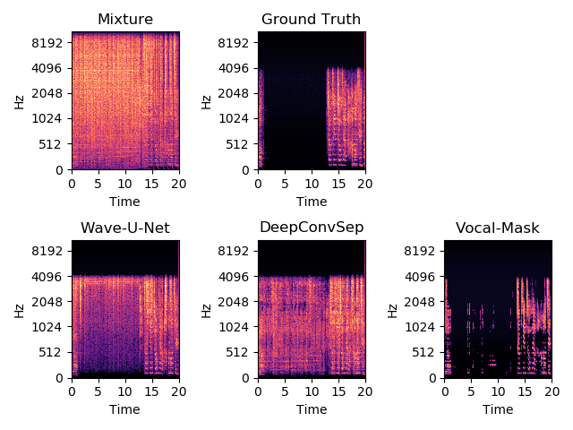
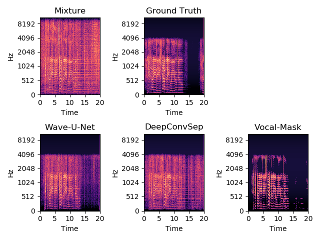

# Vocal Mask CNN

Audio source separation in the music domain.

## Overview

### Problem Formulation

Given a piece of music as input, we want to separate the vocals from the accompanying instrumentation. There are many use cases for this - in music production, a producer may want to extract the vocals from a sample for creative purposes, or a VOIP (voice over IP) application may use it to enhance audio clarity. 

### Approach

We initially considered a WaveNet based approach [1], but since the models were large and potentially difficult to train, we decided it would be best to work with images by converting the input audio to spectrograms via **Short Time Fourier Transforms** (STFT). Previous [spectrogram-based approaches](https://github.com/MTG/DeepConvSep) (DeepConvSep) used an encoder-decoder strategy applied to the entire input spectrogram [2] in order to generate a binary mask of vocal vs non-vocal activity, then this mask is applied to the mixture to generate the isolated spectrograms. However, we found the separation by these methods to be lacking, and looked to make improvements on it. Audio sample comparisons between Wave-U-Net, DeepConvSep, and our model (Vocal-Mask) can be found in the **Results** section.

Due to exploration in other works in the audio domain, we initially chose to use **Mel-scale Spectrograms** as our spectrogram of choice. Mel spectrograms use a transformation matrix to convert a STFT-generated spectrogram to a Mel-scaled spectrogram, which attempts to weight magnitudes of frequencies according to their approximate sensitivity to the human ear. This is useful for speech related models as the highest sensitivity is in the human vocal range. However, the biggest issue with this approach is that recovering the audio from a Mel spectrogram is not trivial. The Mel-transform matrix is non-square, so performing an inverse matrix multiplication to recover the STFT spectrogram is not really possible. One solution we found was to use a [WaveRNN model](https://github.com/G-Wang/WaveRNN-Pytorch) to recover the audio, since this project uses Mel spectrograms as input. We found it very challenging to train this model on musical datasets, and even with speech datasets the audio may not be properly recovered as the Mel spectrogram has a very limited number of frequency bins, thus significant information about the original pitch of the audio is lost.  

As a result, we decided to use spectrograms generated by STFT. Additionally, we applied [Mel perceptual weighting](https://librosa.github.io/librosa/generated/librosa.core.perceptual_weighting.html) to the input spectrograms. After the mask is generated by the model, the mask is applied to the unweighted spectrogram and the audio recovered via inverse STFT. One big advantage of using the full STFT with the masking approach is that we are able to keep the phasing information when masking the mixture, which is necessary for recovering high quality audio. However, since the phasing information does not get passed into the model. This may be an area for further exploration in the future. 

The DeepConvSep model used a combination of vertical and horizontal convolutions in order to capture the timbre of the input audio. Additionally, since the output size is the same as the input size, the amount of data the model uses to produce the output is 1-to-1. In our approach, we captured the timbre information by using very small slices of the input spectrogram, and the model produces the predicted mask for only a single time window in the spectrogram. This way, the timbre is captured by the spectrogram framing, and the model has more input data to work with compared to the output required (25-to-1). Additionally, it allowed us to use a slightly modified ResNet18 model as our convolutional network (we changed the initial downsampling convolution to only downsample in the _y_ direction). 

<p align="center">
    
</p>

This is the approach we ended up with. Input mixture waveforms and target vocal waveforms would be sliced up and converted to spectrograms, then Mel perceptual weightings would be applied. The magnitude of each frequency was also cubed in order to enhance the separation between stronger and softer signals, then the output was scaled to the 0-1 range. 

For the vocal spectrogram, only the center column of the image is kept. This is converted to a binary mask and used as the target label with size (513,). The mixture spectrograms pass through the convolutional neural network, which ends with a 513-way fully-connected layer with a sigmoid to constrain the output to the 0-1 range. We chose to use Binary Cross Entropy Loss as it was well suited for our output and target. 

<p align="center">
    
</p>

At inference time, the input waveforms are sliced into overlapping windows. Each window is converted to Mel-weighted spectrogram and passed through the network to generate the binary mask. The masks are then concatenated and applied to the pre-Mel-weighted spectrogram (which preserves magnitude and phasing information) to produce the isolated vocal-only spectrogram. To produce the background-only spectrogram, the mask can be inverted. The audio can then be recovered via inverse STFT.

Different window sizes for the input spectrogram were tested. Intuitively, larger windows give the network more context for making the prediction. We found that larger window sizes did indeed produce smaller losses, but at a diminishing rate. Larger window sizes also increased GPU memory consumption. We opted to use 25 hop lengths for this project, which is approximately ~290ms of audio. 

<p align="center">
     
</p>

## Usage

### Dataset

We used the [DSD100 dataset](https://sigsep.github.io/datasets/dsd100.html) for this project. The `build_dataset.py` script downsamples the input audio to `hparams.sample_rate` and converts the downsampled audio to spectrogram and saves index slices of the spectrogram. At the smallest slice striding, 100 songs produces approximately 2 million example slices. Not only does this produce more examples for training, but we found the overlapping windows also served the purpose of data-augmentation as it is essentially a horizontal-translation augmentation. We quickly noticed that more examples was improving our models learning ability much more than the complexity and number of parameters of our model, so we augmented the original DSD100 dataset by manually assembling mixture and vocal examples. The process for this was to find waveform stems from remix competitions, sum the stems to produce the mixture, then sum the vocal stems to produce the vocal waveform. 

To generate the dataset, download the DSD100 dataset, then move all files in the Mixtures/Dev and Mixtures/Test directories to the Mixtures/ directory, and do the same for Sources/Dev and Sources/Test. Then, delete the Dev and Test subdirectories and run the script as follows:  
 
```python build_dataset.py <DSD100 root dir> <output dir>```

The window size and striding for the slices are controlled by `hparams.stft_frames` and `hparams.stft_stride`, respectively.

### Training

```python train.py <data dir> --checkpoint=<path to checkpoint file (*.pth)>```

The first argument should be the same as the output directory of `build_dataset`.  
A pretrained model for `hparams.model_type = 'resnet18'` can be downloaded here: [resnet18_step000033000.pth](https://drive.google.com/open?id=19QciqI26LXrJtQqPiilPzhQHNGbx00pP).  
The window size can be modified with `hparams.stft_frames`. Larger window sizes will require more GPU memory.

### Testing

```python generate.py <path to checkpoint file (*.pth)> <path to mixture wav>```  

This will generate a vocal wav file in the `generated` directory. Below are the parameters in `hparams.py` that control how the mask is applied during inference.
- `hparams.mask_at_eval` - If `True`, the model output will be converted to a binary mask. If `False`, it will be left as a softmask with values in the range (0,1). 
- `hparams.eval_mask_threshold` - If `mask_at_eval` is `True`, use this to set the masking threshold. Range (0,1). Lower values will allow more audio through, but may also let some instrumentation through as well.

## Results

### Training

A cyclic learning rate scheduler was used to train the model. A learning rate finder was used find reasonable learning rate boundaries [5]. Based on the plot below, the learning range was selected to be from 5e-5 to 2e-4.

<p align="center">
    
</p>

The model was trained for about 4 epochs in total - further training did not improve the validation loss.

<p align="center">
    
</p>

### Generated Masks  

Below are example masks generated by the model and the corresponding masked-mixture spectrograms.  

<p align="center">
     
</p>

### Example Audio  
Audio examples were taken from [here](http://jordipons.me/apps/end-to-end-music-source-separation/) for comparison purposes.

| Mixture | Wave-U-Net | DeepConvSep | Vocal-Mask | Ground Truth |
|--------------------------------------------------------------------------------|--------------------------------------------------------------------------------|--------------------------------------------------------------------------------|--------------------------------------------------------------------------------|--------------------------------------------------------------------------------|
| [Sample 1](https://drive.google.com/open?id=1ZO4g_1R3W1fVodf9RouIdywGIIAVJpvs) | [Sample 1](https://drive.google.com/open?id=1A1w2CKLJCrEX34VPRG1Yun5Hppgias1S) | [Sample 1](https://drive.google.com/open?id=18VOe6ADNbFN7KibjctGmKPwJ5UXleg7Y) | [Sample 1](https://drive.google.com/open?id=16u4i3a0uQuqTSkXP2YBC40JYr2VBxzwT) | [Sample 1](https://drive.google.com/open?id=1EBcu9BbGcXvAwgBHlkbRTmH-j97XLNGy) |
| [Sample 2](https://drive.google.com/open?id=1alGKLhc0J8yc_8P4GpBgns0DRtJMcFP4) | [Sample 2](https://drive.google.com/open?id=1y2LiTnpf4khqqVQWEs_llHrwR9j8BWAy) | [Sample 2](https://drive.google.com/open?id=1ZSH0R6s5K3kAO3VW_5cR79xu8mxNpdtW) | [Sample 2](https://drive.google.com/open?id=1yHYiZPfLoaLnhXtvHOlz3BKyWNwUEU8H) | [Sample 2](https://drive.google.com/open?id=1Vh3mKoC1fddg-6142pggoBreCCla7dCg) |
| [Sample 3](https://drive.google.com/open?id=1GHGi8i-eRXNEnk88-iLxyOYa0uz8KDlM) | [Sample 3](https://drive.google.com/open?id=1tf1l4yJh8GG_o3pejD5TZm3s8Dw4IrZP) | [Sample 3](https://drive.google.com/open?id=1ND9H6Det-yWDjjhwEzZjjgflBQWyeN2W) | [Sample 3](https://drive.google.com/open?id=196va9Kz493MpKcn4msbfvrAsmswOhcFL) | [Sample 3](https://drive.google.com/open?id=1FiJIm1o3Iz6R52W8oDd2nMTH2INyPzDy) |
| [Sample 4](https://drive.google.com/open?id=1l8wmEc_6yd32VPUYDYOUFZINqtK-Eif4) | [Sample 4](https://drive.google.com/open?id=1BZJDfQWgqJs_s-QWoU0DM4Ma1JZKPBYL) | [Sample 4](https://drive.google.com/open?id=1etJQe4R3lo47nV4GhgXOyBlsUGVLcw0c) | [Sample 4](https://drive.google.com/open?id=1_6Bs1sSxPMO1InelVyo49OsQ4nEK8Zsj) | [Sample 4](https://drive.google.com/open?id=1sok6Pd3MweEw0LDJ8TWG8CxprxPr6pia) |
| [Sample 5](https://drive.google.com/open?id=1wHpW9AxXDg-BZMyxc4XndCHDgkZ5zaL7) | [Sample 5](https://drive.google.com/open?id=1ENCfiPg--AAF3cDRgN9_ebRR4v-W_QYF) | [Sample 5](https://drive.google.com/open?id=19bQGqkKEbHjYrQ-_VB0TqaSORVmu1xGu) | [Sample 5](https://drive.google.com/open?id=1K1ztdEJo46WCwkmEAY6APTRHA88uPxNJ) | [Sample 5](https://drive.google.com/open?id=1Nr1oCb2NE0qZepbkBpJ6oR_6fDxbGvqW) |

### Spectrogram Comparisons  
Note: The Ground Truth, Wave-U-Net, and DeepConvSep samples have lower sample rate, so the spectrogram is cut off above 4096Hz. 

Sample 1 Spectrograms  
<p align="center">
    
</p>

Sample 2 Spectrograms  
<p align="center">
    
</p>

Sample 3 Spectrograms  
<p align="center">
    
</p>

Sample 4 Spectrograms  
<p align="center">
    
</p>

Sample 5 Spectrograms  
<p align="center">
    
</p>

### Quantitative Comparisons

Below are quantitative evaluations of the signal and separation quality based on BSS Eval metrics. Shown are the median SDR values when applying the model to the MusDB18 test set. Higher values indicate better separation and signal quality.

| Model | Vocal SDR | Accompaniment SDR |
|-------------|-----------|----------|
| DeepConvSep | 2.37 | N/A |
| Wave-U-Net | 4.60 | 11.87 |
| Vocal-Mask (Initial) | 2.84 | 6.89 |

## Discussion  

The model converges very quickly within 2-3 epochs and eventually reaches a validation loss of about 0.165. 
We found that the validation loss improved significantly the more training data was available, so although the qualitative results of our model are decent, it would likely further improve with more data. 

Qualitatively, we found that our model worked best on acoustic or pop music where the vocals are more prominent in the mix. Fuller mixes have less variation between peaks and troughs in the spectrogram, which resulted in the model having a harder time picking out vocal features and creating less separation. 
Compared to Wave-U-Net, we found that Wave-U-Net was able to produce stronger isolations, but at the cost of adding noticable noise artifacts. Our model was generally very liberal with cutting out audio, and could produce fairly high quality audio with good vocal isolation on some input, but tended to cut out too much vocal information in other input. In particular, our model seems to cut out lower frequency components to the vocal. This might be improved by changing how the input spectrograms are preprocessed. Compared with DeepConvSep, our model produced better separation on most inputs.

All models had trouble with whispered or under-the-breath vocals, as can be heard near the beginning of **Sample 5**. Since the signal is soft relative to the background, the whispered vocal is buried within the input.

There are several next steps that could be taken to improve the model as is. One area is to increase the amount of training examples, but this likely would not help with the full-mix problem. Another area is increasing the number of input channels. The model currently uses a single input channel containing only the monophonic magnitude spectrogram. Another possibility is to use two channel input, one channel for each of the [mid and side signals](https://www.izotope.com/en/blog/mastering/what-is-midside-processing.html). The mid signal is comprised of elements that are common to both the left and right audio signals, while the side signal is comprised of the difference between the left and right signals. This may help because in recorded music, the vocals and percussion tend to be mostly contained in the mid signal, while other accompaniment may be spread between mid and side signals. Stereo processing may also be possible (one channel for the left audio and the other channel for the right audio), but these will likely look more similar to each other than mid-side channels.


## References

[1] End-to-end music source separation: is it possible in the waveform domain? https://arxiv.org/abs/1810.12187  
[2] Monoaural Audio Source Separation Using Deep Convolutional Neural Networks. http://mtg.upf.edu/node/3680  
[3] Efficient Neural Audio Synthesis. https://arxiv.org/abs/1802.08435v1  
[4] Liutkus, A., Stoter, F.R., Rafii, Z. The 2016 Signal Separation Evaluation Campaign. https://sigsep.github.io/datasets/dsd100.html  
[5] Cyclic Learning Rates. https://arxiv.org/abs/1506.01186  
